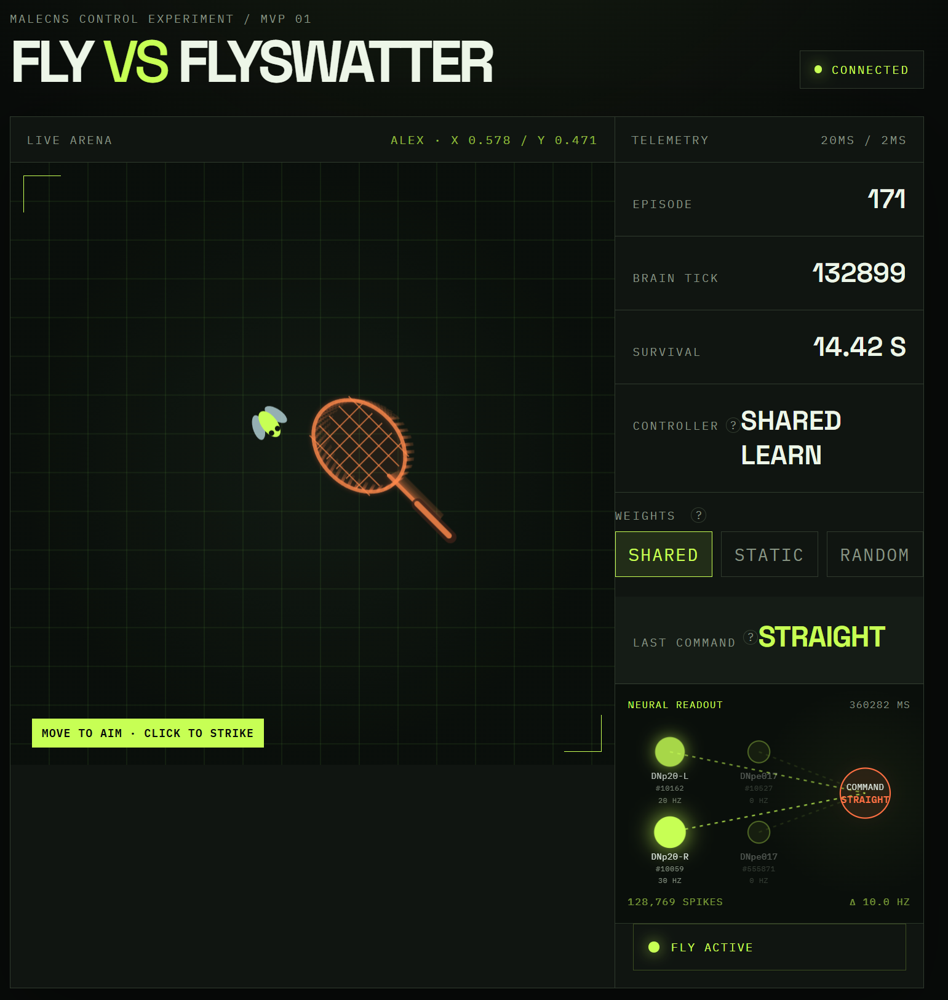

# Fly vs Flyswatter

Browser game where a simulated fruit-fly connectome (MaleCNS) steers a virtual fly while you try to hit it with a flyswatter.



## What you get

- Mouse-aimed flyswatter with wind-up strikes and light inertia
- Live arena over WebSocket
- Optional MaleCNS controller that turns retinal frames into `turn_left` / `turn_right` / `straight` / `escape`
- Neural readout panel for descending-neuron activity
- Shared MaleCNS weights with engineered dopamine plasticity across players

First visit asks for a player name (saved locally). The same name in a second tab replaces the older session.

## Scientific boundaries

- Wiring-constrained simulation, not a copy of a living fly
- Pixel→photoreceptor mapping and neuron→command decoding are engineered
- Synaptic weight changes alone are not validated learning

## Quick start

### Requirements

- Go 1.22+
- Node.js 20+
- Optional for MaleCNS: [uv](https://docs.astral.sh/uv/), Python 3.14, a C++17 compiler, ~1.1 GB download + several GB disk

### 1. Backend

```sh
go run ./cmd/server
```

Listens on `127.0.0.1:8080` by default (`FLYSWATTER_ADDR` overrides).

Without MaleCNS setup the server falls back to the random controller. To require MaleCNS:

```sh
# Windows PowerShell
$env:FLYSWATTER_CONTROLLER = "malecns"
go run ./cmd/server
```

```sh
# Linux / macOS
export FLYSWATTER_CONTROLLER=malecns
go run ./cmd/server
```

### 2. Frontend

```sh
cd frontend
npm install
npm run dev
```

Open `http://127.0.0.1:5173`, enter a name, aim, click to strike.

### 3. MaleCNS (optional)

Windows:

```powershell
powershell -ExecutionPolicy Bypass -File scripts/setup_neural.ps1
```

This creates `.venv-neural` with `uv`, installs `neural_worker` deps from the locked `pyproject.toml`, and prepares MaleCNS data under ignored local paths.

Linux sketch (same idea):

```sh
git submodule update --init --recursive
uv venv .venv-neural --python 3.14
UV_PROJECT_ENVIRONMENT=.venv-neural uv sync --project neural_worker
export PYTHONPATH="$PWD/third_party/stonkfly"
export STONKFLY_DATA="$PWD/.local/malecns"
.venv-neural/bin/python -c 'from stonkfly.data import prepare; prepare()'
```

## Useful checks

```sh
go test ./...
go vet ./...
```

```sh
cd frontend
npm run typecheck
npm run lint
npm test
npm run build
```

## How it fits together

```text
Browser canvas  --WebSocket-->  Go game server  --IPC-->  MaleCNS worker
     ^                              |                         |
     |                              |                         |
  input + draw                 authority + sessions      spikes + decode
```

Game checkpoints and replay logs live under `runs/<player>/`. Shared learning weights live under `runs/_shared/brain.npz`. MaleCNS membrane state is not restored across restarts; telemetry refreshes live.

Common env vars: `FLYSWATTER_ADDR`, `FLYSWATTER_CONTROLLER` (`auto` / `malecns` / `random`), `FLYSWATTER_RUNS_DIR`, `FLYSWATTER_PYTHON`, `STONKFLY_DATA`, `FLYSWATTER_LOG_LEVEL`, `FLYSWATTER_LOG_FILE`.

## Attribution

MaleCNS runs through the pinned StonkFly submodule. See [`THIRD_PARTY.md`](THIRD_PARTY.md).

## License

Project-owned code: [MIT](LICENSE). StonkFly / MaleCNS data keep their upstream licenses.
